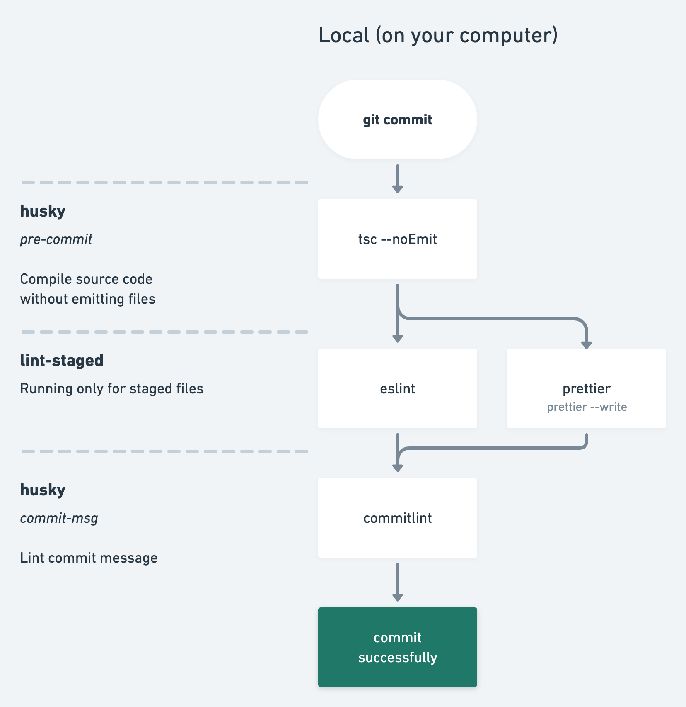
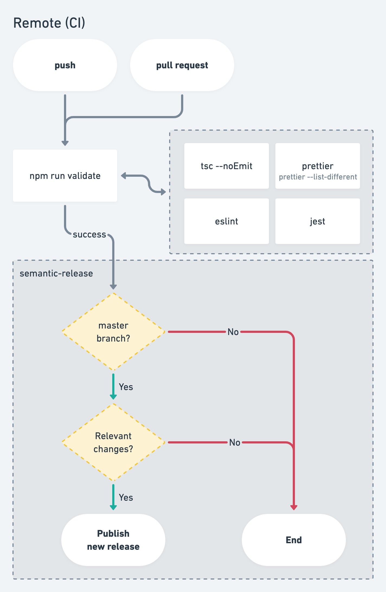

# semantic-release-test

Me just playing with [semantic-release](https://github.com/semantic-release/semantic-release).

## 🔁 Flow

### Local (on your computer)

See [`.huskyrc`](./.huskyrc), [`.lintstagedrc`](./.lintstagedrc), [`package.json`](./package.json), [`commitlint.config.js`](./commitlint.config.js)

### Remote (CI)

See [`.github/workflows/nodejs.yml`](./.github/workflows/nodejs.yml)

## 🔖 License

The MIT License (MIT). Please see [License File](LICENSE.md) for more information.

Created with 🔥 by [@de_patwoz](https://twitter.com/de_patwoz)
